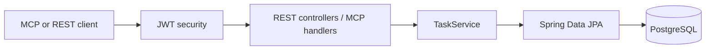

# TaskPilot MCP Server

TaskPilot is a secure, PostgreSQL-backed task management service exposing REST and Model Context Protocol (MCP) interfaces. MCP clients can discover tools, read task resources, and use planning prompts over Streamable HTTP.

## Architecture



## Stack

Java 21, Spring Boot 4.1.1, Spring AI MCP 2.0.1, Spring Data JPA, PostgreSQL, Flyway, Spring Security, JWT, Actuator, Docker.

## Local setup

1. Install Java 21.
2. Create a local PostgreSQL database, or use a Supabase PostgreSQL connection.
3. Copy `.env.example` to `.env` and replace the placeholder password and application secrets.
4. Run `./mvnw spring-boot:run` on macOS/Linux or `mvnw.cmd spring-boot:run` on Windows.
5. Authenticate at `POST /api/auth/login`, then send the returned bearer token to protected endpoints.

Required production variables are `DATABASE_HOST`, `DATABASE_PORT`, `DATABASE_NAME`, `DATABASE_USERNAME`, `DATABASE_PASSWORD`, `DATABASE_SSL_MODE`, `JWT_SECRET` (at least 32 bytes), `AUTH_USERNAME`, and `AUTH_PASSWORD`. You may instead provide `DATABASE_URL` directly. `SERVER_PORT` defaults to `8080`. See `.env.example` for the Supabase connection shape; never commit real passwords or secrets.

Spring Boot loads an optional project-root `.env` file. On Windows, create it with `Copy-Item .env.example .env`; local `.env` files are ignored by Git.

For Supabase, use the session pooler host and `sslmode=require`. Set the variables in PowerShell before starting the app, for example:

```powershell
$env:DATABASE_HOST="aws-0-ap-south-1.pooler.supabase.com"
$env:DATABASE_PORT="5432"
$env:DATABASE_NAME="postgres"
$env:DATABASE_USERNAME="postgres.<project-ref>"
$env:DATABASE_PASSWORD="your-rotated-supabase-password"
$env:DATABASE_SSL_MODE="require"
```

## Docker

Set strong `JWT_SECRET` and `AUTH_PASSWORD` values in the environment, then run:

```text
docker compose up --build
```

The compose file starts PostgreSQL, waits for its health check, runs Flyway, and exposes the application on `SERVER_PORT`.

## REST API

| Method | Path | Purpose |
|---|---|---|
| POST | `/api/auth/login` | Issue a JWT |
| GET | `/api/tasks` | List/filter tasks |
| GET | `/api/tasks/{id}` | Read one task |
| POST | `/api/tasks` | Create a task |
| PUT | `/api/tasks/{id}` | Update a task |
| PATCH | `/api/tasks/{id}/complete` | Complete a task |
| DELETE | `/api/tasks/{id}` | Delete a task |
| GET | `/api/tasks/overdue` | List overdue work |
| GET | `/api/tasks/statistics` | Read task statistics |
| GET | `/actuator/health` | Health check |

## MCP surface

Tools: `createTask`, `getTask`, `getTasks`, `updateTask`, `deleteTask`, `completeTask`, `getOverdueTasks`, and `getTaskStatistics`.

Resources: `tasks://all`, `tasks://pending`, `tasks://completed`, and `tasks://overdue`.

Prompts: `daily-planning`, `weekly-review`, and `task-prioritization`.

The Streamable HTTP MCP endpoint is `/mcp`. It is protected by the same JWT security chain as the REST API.

## Tests and deployment

Run `mvnw.cmd test` on Windows or `./mvnw test` on Unix systems. The test profile uses an in-memory H2 database; production uses PostgreSQL and Flyway. A Docker-compatible cloud platform should provide a managed PostgreSQL instance, the variables above, and an HTTP health check for `/actuator/health`. A live cloud deployment has not been performed by this repository.

## Future improvements

Add account persistence and refresh tokens, pagination, role-based authorization, Testcontainers coverage in CI, and richer prompt arguments once a client workflow requires them.